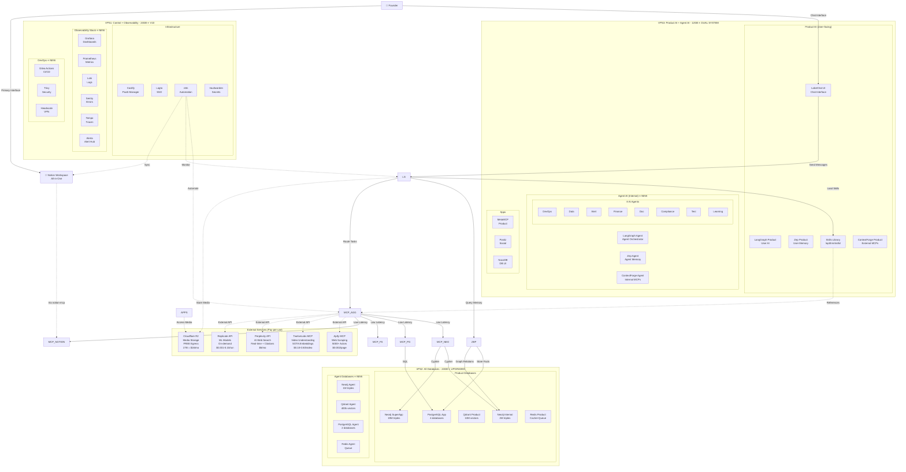

# 🏗️ SYSTEM ARCHITECTURE - AI CÓ MÁY TÍNH

**Version:** 10.0 ULTIMATE (Autonomous Operations Era)  
**Date:** 04/11/2025  
**Status:** 🔥 Production-Ready with 8 AI Agents + Full Observability
**Master Diagram:** See `../diagrams/manual/00-TRM-MASTER-V10-ULTIMATE.mmd` (657 lines, complete)

> **Note**: This document provides architecture overview. For complete visual diagram with all connections, see the master Mermaid diagram file.

---

## 🎯 ARCHITECTURE OVERVIEW

### **4-Tier Hybrid Model: VPS Orchestration + Skills + MCPs + External Services** ⭐
### **V10 ULTIMATE: 3-VPS Optimized + 8 AI Agents + Full Observability**



---

## 📊 COMPONENT BREAKDOWN

### **VPS1: Database Layer (30GB RAM, 800GB SSD)**

#### **Neo4j Dual Instance**

**Internal (2M triples - 8GB RAM)**
```yaml
Purpose: Fast AI queries, frequently accessed data
Data:
  - Core ontologies
  - Recent entities (last 6 months)
  - Hot relationships
  - AI session context
Performance: <50ms queries
Disk: ~50-100GB
```

**SuperApp (19M triples - 12GB RAM)**
```yaml
Purpose: Full product knowledge graph
Data:
  - Complete product catalog
  - Historical data
  - External integrations
  - RDF/OWL ontologies (n10s plugin)
Performance: <200ms queries
Disk: ~300-400GB
```

**Configuration:**
```properties
# neo4j.conf
dbms.memory.heap.initial_size=8g
dbms.memory.heap.max_size=8g
dbms.memory.pagecache.size=4g
dbms.security.auth_enabled=true
dbms.connector.bolt.listen_address=0.0.0.0:7687

# n10s plugin enabled
dbms.unmanaged_extension_classes=n10s.endpoint=/rdf
```

#### **Qdrant Vector Database (8GB RAM)**

```yaml
Purpose: Semantic search, embeddings storage

Collections:
  text_embeddings:
    - Vectors: 768-dim (text-embedding-3-large)
    - Count: ~5M
    - Size: ~4GB
  
  video_embeddings:
    - Vectors: 1024-dim (TwelveLabs Marengo)
    - Count: ~50k videos
    - Size: ~500MB
  
  entity_embeddings:
    - Vectors: 768-dim
    - Count: ~2M entities
    - Size: ~1.5GB

Configuration:
  - HNSW index (fast search)
  - Quantization enabled (50% RAM reduction)
  - Replication factor: 1
  
Performance: <200ms search (10 neighbors)
Disk: ~100-150GB
```

#### **PostgreSQL + TimescaleDB (4GB RAM)**

```yaml
Purpose: Structured data, time-series, NocoDB backend

Databases:
  - trm_main: Core application data
  - zep_memory: Zep storage
  - nocodb: NocoDB metadata
  - timescale: Metrics, logs

Tables (examples):
  - users, projects, tasks
  - api_logs (TimescaleDB hypertable)
  - cost_tracking (TimescaleDB)
  - files_registry (Notion sync)

Performance: <50ms simple queries
Disk: ~50-100GB
```

#### **Redis Cluster (2GB RAM)**

```yaml
Purpose: Cache, queue, pub/sub

Keyspaces:
  - cache:neo4j:* (query results, 30min TTL)
  - cache:qdrant:* (search results, 10min TTL)
  - task:*:status (idempotent task tracking)
  - queue:celery (background jobs)
  - session:* (user sessions)

Configuration:
  - Persistence: RDB (15min snapshots)
  - Eviction: LRU
  - Max memory: 1.5GB (+ 500MB buffer)

Disk: ~10-20GB (persistence)
```

**Total VPS1 Resources:**
- RAM: 20-24GB used / 30GB (margin: 6-10GB)
- Disk: ~510-670GB / 800GB (margin: 130-290GB)

---

### **VPS2: AI Orchestration Layer (30GB RAM, 800GB SSD)**

#### **GUI Layer - LobeChat (2GB RAM)**

```yaml
Purpose: Modern chat interface cho founder

Features:
  ✅ MCP support (native integration)
  ✅ Multi-model routing (Claude, Grok, Gemini)
  ✅ File upload / RAG
  ✅ Artifacts / Thinking display
  ✅ Branching conversations
  ✅ Knowledge base
  ✅ Agent marketplace

Technology:
  - Next.js 14 (App Router)
  - Vercel AI SDK
  - React Server Components
  - Streaming responses
  
Deployment:
  - Docker via Coolify
  - Port: 3210
  - Subdomain: chat.trm.local
  - Auth: Optional (internal use)

Configuration:
  - Connect to 1MCP Aggregator
  - Model API keys (Claude, Grok, Gemini)
  - Custom system prompts
  - Theme: Dark mode default

Why LobeChat:
  ✅ Open-source (MIT license)
  ✅ Self-hostable
  ✅ MCP native support
  ✅ Modern UI/UX
  ✅ Active development
  ✅ Production-ready

Alternatives considered:
  - Vercel AI SDK (too low-level, need UI)
  - Custom Next.js (reinventing wheel)
  - Chatbot UI (less features)
```

#### **AI Core**

**LangGraph (8GB RAM)**
```yaml
Purpose: Cognitive orchestration engine

Architecture:
  StateGraph với checkpointing:
    Nodes:
      - Perception: Analyze input
      - Reasoning: Plan approach
      - Decision: Choose actions
      - Execution: Call MCPs
      - Reflection: Learn from results
    
    Edges:
      - Conditional routing
      - Loop back on errors
      - Human-in-loop breakpoints

State Management:
  - PostgreSQL backend (persistent)
  - Redis cache (hot state)
  - Zep memory integration

Multi-Model Routing:
  - Claude 4.5 Sonnet: Strategic decisions
  - Grok 2: Fast coding tasks
  - Gemini Flash: Simple operations

Conflict Prevention:
  - Pessimistic locking (Redis)
  - Neo4j MERGE (upsert only)
  - Idempotent task design
  - Zep deduplication

Configuration:
  - Max parallel tasks: 5
  - Timeout: 5 min (except batch jobs)
  - Retry: 3 attempts with exp backoff
  - Checkpointing: Every node

Disk: ~5GB (logs, checkpoints)
```

**Zep Memory (4GB RAM)**
```yaml
Purpose: Long-term memory, temporal knowledge graph

Architecture:
  - Graphiti temporal KG engine
  - Fact extraction from conversations
  - Entity linking + deduplication
  - Contradiction resolution
  - Time-aware reasoning

Storage:
  - Facts: PostgreSQL (structured)
  - Graph: Neo4j Internal (relationships)
  - Embeddings: Qdrant (semantic search)

Features:
  ✅ Cross-session memory
  ✅ Auto-deduplication
  ✅ Entity recognition
  ✅ Temporal queries ("what did we discuss last week?")
  ✅ Fact verification

Integration:
  - LangGraph queries Zep before decisions
  - Every interaction stored
  - Memory pruning (low-relevance facts)

Configuration:
  - Session TTL: Unlimited (permanent)
  - Fact extraction: GPT-4o-mini
  - Entity linking: Automatic
  - Graph update: Real-time

Disk: ~10GB (fact storage)
```

**1MCP Aggregator (2GB RAM)**
```yaml
Purpose: Single endpoint for all MCPs

Features:
  - Route to internal/external MCPs
  - Health checks + auto-restart
  - Load balancing (if multiple instances)
  - Request logging
  - Cost tracking

Configuration:
  Internal MCPs:
    - neo4j-mcp: stdio
    - postgres-mcp: stdio
    - filesystem-mcp: stdio
    - shell-mcp: stdio
    - notion-mcp: stdio (official)
  
  External MCPs:
    - Apify: HTTPS (mcp.apify.com)
    - TwelveLabs: API key
    - Perplexity: API key
    - Replicate: API key

Routing Logic:
  def route(task_type):
      if task_type in ["neo4j", "postgres", "notion"]:
          return "internal"
      if task_type == "web_scraping":
          return "apify"
      if task_type == "video":
          return "twelvelabs"
      # ... etc

Port: 8100 (internal only)
```

#### **Internal MCPs (2GB RAM total)**

```yaml
neo4j-mcp (400MB):
  - Direct Neo4j Bolt connection
  - Cypher query tool
  - Batch operations
  - MERGE-only writes (prevents duplicates)

postgres-mcp (400MB):
  - PostgreSQL connection
  - SQL query tool
  - Transaction support
  - Prepared statements

filesystem-mcp (400MB):
  - Read/write VPS files
  - Directory operations
  - Search content
  - Symlink support

shell-mcp (400MB):
  - Execute bash scripts
  - Background jobs (nohup)
  - Process management
  - Environment variables

notion-mcp (400MB):
  - Official Anthropic MCP
  - Read/write databases
  - Create pages
  - Update properties
  - Search workspace
```

#### **Apps via Coolify (10GB RAM allocated, ~3GB used)**

```yaml
Coolify (1GB):
  - Port: 8000
  - Manages all apps
  - Auto-SSL (Let's Encrypt)
  - Git deployments
  - Monitoring dashboard

NocoDB (500MB):
  - Port: 8080
  - PostgreSQL UI
  - API auto-generation
  - Airtable-like interface
  - Multi-user support

n8n (1GB):
  - Port: 5678
  - Workflow automation
  - 350+ integrations
  - Webhooks
  - Schedules
  Key workflows:
    - VPS health monitoring → Telegram
    - Cost tracking → Notion
    - File sync → R2
    - Backup automation

Postiz (500MB):
  - Port: 5000
  - Social media scheduling
  - Multi-platform support
  - Analytics
  - AI-powered captions

Vaultwarden (200MB):
  - Port: 8200
  - Password manager
  - API keys storage
  - 2FA support

Watchtower (100MB):
  - Auto-update Docker images
  - Security patches
  - Notification on updates
```

**Total VPS2 Resources:**
- RAM: 20-23GB used / 30GB (margin: 7-10GB)
- Disk: ~280GB / 800GB (margin: 520GB)

---

## 🌐 EXTERNAL SERVICES

### **Cloudflare R2 (Object Storage)**

```yaml
Purpose: Media storage with free egress

Buckets:
  trm-media:
    Structure:
      /videos/
        /raw/ (uploaded files)
        /processed/ (TwelveLabs outputs)
        /thumbnails/
      /images/
      /audio/
      /documents/
      /exports/

Access:
  - S3-compatible API
  - CDN URL: https://media.trm.ai/*
  - Direct upload from LobeChat
  - Presigned URLs (temporary access)

Cost:
  - Storage: $0.015/GB/month (1TB = $15)
  - Egress: $0 (unlimited!)
  - Class A ops: $4.50/million (writes)
  - Class B ops: $0.36/million (reads)
  
  Realistic monthly:
    1TB storage: $15
    100k writes: $0.45
    1M reads: $0.36
    Total: ~$16/month

Integration:
  - s3-mcp for file operations
  - LangGraph auto-uploads media
  - Notion Files Registry tracks URLs
  - N8N syncs metadata
```

### **Apify MCP (Web Scraping)**

```yaml
Purpose: Production-grade web scraping

Actors (examples):
  - instagram-scraper
  - facebook-posts-scraper
  - twitter-scraper
  - linkedin-scraper
  - google-maps-scraper
  - amazon-products-scraper
  - web-scraper (general)
  - rag-web-browser (AI-optimized)

Features:
  ✅ Anti-ban measures
  ✅ Proxy rotation
  ✅ Rate limiting
  ✅ JS rendering
  ✅ Cookie handling
  ✅ CAPTCHA solving

Cost:
  - Pay-per-run model
  - ~$0.002/page average
  - $10/month = ~5000 pages
  - Cheaper than self-hosting

API:
  - MCP endpoint: https://mcp.apify.com
  - Auth: Bearer token (Vaultwarden)
  - Rate limit: Generous
  - Webhooks: Completion notifications

Integration:
  - LangGraph calls via 1MCP Aggregator
  - Results → PostgreSQL + Neo4j
  - Files → Cloudflare R2
  - Status → Notion
```

### **TwelveLabs MCP (Video Understanding)**

```yaml
Purpose: SOTA video intelligence

Capabilities:
  - Visual search (find scenes)
  - Audio transcription
  - Object detection
  - Action recognition
  - Emotion detection
  - Scene classification
  - Generate summaries
  - Multi-vector embeddings (visual + audio + text)

Models:
  - Marengo 2.7 (beats GPT-4V)
  - Pegasus (video generation)
  - Jockey (video editing agent)

Cost:
  - Indexing: $0.05-0.50/min (depends on features)
  - Search: Free (after indexing)
  - Generation: $0.10-0.30/video

Typical workflow:
  1. Upload video to R2
  2. Send R2 URL to TwelveLabs
  3. TwelveLabs indexes (~1-3 min)
  4. Receive embeddings + metadata
  5. Store embeddings → Qdrant
  6. Store metadata → Neo4j
  7. Update Notion Files Registry

Integration:
  - API key in Vaultwarden
  - LangGraph calls via 1MCP
  - Async processing (don't block)
  - n8n monitors job status
```

### **Perplexity API (AI Search)**

```yaml
Purpose: Real-time web search with citations

Models:
  - sonar (fast, $0.005/query)
  - sonar-pro (deep, $0.01/query)

Features:
  ✅ Real-time web access
  ✅ Multiple sources combined
  ✅ Citations included
  ✅ Fact-checked answers
  ✅ Follow-up questions

Cost:
  - $5/month (1000 queries)
  - Additional: $0.005/query

Use cases:
  - Research tasks
  - Market intelligence
  - Competitor analysis
  - Fact verification
  - Latest news/trends

Integration:
  - API key in Vaultwarden
  - LangGraph routes research tasks
  - Results stored in Notion
  - Entities extracted → Neo4j
```

### **Replicate API (ML Models on-demand)**

```yaml
Purpose: Ad-hoc ML model inference

Models (examples):
  - FLUX.1 (image generation)
  - Stable Diffusion XL
  - ESRGAN (upscaling)
  - Whisper (audio transcription)
  - MusicGen (audio generation)
  - Background removal

Cost:
  - Pay-per-run
  - $0.001-0.10/run (depends on model)
  - No monthly minimum

When to use:
  - Occasional image generation (<10/day)
  - One-off tasks
  - Testing models
  - Not worth GPU VPS

Integration:
  - API key in Vaultwarden
  - LangGraph calls when needed
  - Results → Cloudflare R2
```

---

## 🔄 DATA FLOW PATTERNS

### **Pattern 1: Heavy Workload (Video Processing)**

```
1. Founder: "Process 10 videos, tag topics and emotions"
   └→ LobeChat UI
   
2. LobeChat → LangGraph
   └→ Analyze request, check Zep memory
   
3. LangGraph → 1MCP Aggregator
   └→ Route to TwelveLabs MCP (external)
   
4. TwelveLabs MCP:
   - Upload videos to R2
   - Index with Marengo 2.7
   - Extract embeddings + metadata
   - Return results
   
5. LangGraph processes results:
   - Store embeddings → Qdrant
   - Store metadata → Neo4j (MERGE)
   - Update Files Registry → Notion (via notion-mcp)
   - Add to Zep memory
   
6. Notify founder:
   - LobeChat: "10 videos processed, tagged"
   - Telegram: Alert with summary
   
Time: 10-30 mins (async)
Cost: ~$5 (10 videos × $0.50)
```

### **Pattern 2: Web Research & Scraping**

```
1. Founder: "Research top 100 AI startups, their funding and tech stack"
   └→ Notion (assigns task to AI)
   
2. n8n webhook → LangGraph
   └→ New task detected
   
3. LangGraph plans:
   - Step 1: Perplexity search for startups list
   - Step 2: Apify scrape each startup website
   - Step 3: Extract data → Neo4j
   
4. Execute:
   a) Perplexity MCP: Get startups list (10s, $0.01)
   b) Apify MCP: Scrape 100 sites (5 mins, $0.20)
   c) LangGraph: Extract entities, relationships
   d) Neo4j MCP: MERGE entities (prevents duplicates)
   e) Qdrant: Store embeddings for search
   
5. Results:
   - Notion database updated (100 rows)
   - Neo4j graph visualizable
   - Semantic search enabled
   
Time: 10-15 mins
Cost: $0.21
```

### **Pattern 3: Memory-Driven Conversation**

```
1. Founder (LobeChat): "What did we discuss about SuperApp features last week?"
   
2. LangGraph → Zep Memory
   - Query temporal KG
   - Filter by: last 7 days, topic=SuperApp
   - Get relevant facts + entities
   
3. Zep returns:
   - 15 facts from 3 conversations
   - Linked entities (features, decisions, blockers)
   - Temporal context
   
4. LangGraph → Neo4j (for current SuperApp data)
   - MATCH (f:Feature {project:"SuperApp"})
   - Cross-reference with Zep memory
   
5. LangGraph synthesizes answer:
   - "Last week we discussed 5 features..."
   - "Decided to prioritize X, Y, Z"
   - "Blocker on feature A: needs API integration"
   
6. Add current interaction to Zep
   - Fact: "Founder asked about SuperApp features recap"
   - Entity linking: SuperApp, Features
   
Time: <5s
Cost: ~$0.01
```

---

## 🛡️ SECURITY & ACCESS CONTROL

### **VPS Hardening**

```yaml
Firewall (UFW):
  - Port 22: SSH (key-only, no password)
  - Port 80/443: HTTP/HTTPS (Coolify)
  - Port 8100: 1MCP (internal only, VPS1↔VPS2)
  - Ports 7687, 5432, 6379, 6333: DB ports (VPS1↔VPS2 only)
  - All other ports: BLOCKED

SSH:
  - Key-based authentication only
  - Disable root login
  - Fail2ban (5 attempts → 1 hour ban)
  - Non-standard port (recommended)

Docker:
  - Rootless mode (recommended)
  - Network isolation per service
  - Resource limits (CPU, RAM)
  - Read-only filesystems where possible

Secrets Management:
  - Vaultwarden for all credentials
  - Environment variables via Coolify
  - No secrets in code
  - Rotate keys quarterly
```

### **API Security**

```yaml
External APIs:
  - API keys in Vaultwarden
  - Rotate keys monthly
  - Rate limiting (client-side)
  - Cost alerts (>$10/day)

Internal APIs:
  - 1MCP: Internal network only
  - LobeChat: Optional basic auth
  - Coolify: Strong password + 2FA
  - NocoDB: User-based access control

Monitoring:
  - n8n: API usage tracking
  - Alerts on unusual patterns
  - Daily cost reports
  - Failed auth attempts logged
```

---

## 📈 SCALING PATHS

### **Scenario A: More Data (>30M Neo4j triples)**

```yaml
Option 1: Upgrade VPS1 RAM
  - Contabo 60GB RAM: +€15/month
  - Support up to 50M triples
  - Simple, no migration

Option 2: Add 3rd VPS (Neo4j dedicated)
  - VPS3: 30GB RAM, Neo4j only
  - Split: Internal (VPS1), SuperApp (VPS3)
  - Cost: +$15/month

Recommended: Option 1 (upgrade)
```

### **Scenario B: Heavy Concurrent Workloads**

```yaml
Option 1: Add GPU VPS (on-demand)
  - RunPod GPU: $0.40/hour
  - Use for video/image processing bursts
  - Turn off when idle
  - Cost: ~$50-100/month (usage-based)

Option 2: Scale LangGraph horizontally
  - Deploy multiple LangGraph instances
  - Load balancer (nginx)
  - Shared state (PostgreSQL + Redis)
  - Cost: +$15/month per instance

Recommended: Option 1 (GPU on-demand)
```

### **Scenario C: High LobeChat Usage**

```yaml
If >10 concurrent users:
  - Move LobeChat to Vercel (free tier)
  - Or upgrade VPS2 to 60GB RAM
  - Enable Redis session storage
  - Add CDN (Cloudflare free)

Cost: $0-15/month
```

### **Scenario D: SuperApp Goes Live (Customer Traffic)**

```yaml
IMPORTANT: Separate production infrastructure
  - Current VPS = internal/dev only
  - New architecture for customer-facing:
      * Kubernetes cluster (DigitalOcean/AWS)
      * Managed databases (avoid self-hosting)
      * CDN for static assets
      * Load balancers
      * Auto-scaling
  
  Keep internal AI system independent
  
  Estimated cost: $500-1000/month (depends on traffic)
```

---

## 💰 TOTAL COST BREAKDOWN

```yaml
Infrastructure (Fixed):
  VPS1 Contabo 30GB: $15/month
  VPS2 Contabo 30GB: $15/month
  Cloudflare R2 (1TB): $16/month
  Backblaze B2 (backup 500GB): $2.50/month
  ──────────────────────────
  Subtotal: $48.50/month

APIs (Variable, Usage-based):
  LLMs:
    - Claude 4.5 Sonnet: ~$15/month
    - Grok 2: ~$12/month
    - Gemini Flash: ~$3/month
  
  External MCPs:
    - Apify (scraping): ~$10/month
    - TwelveLabs (video): ~$15/month
    - Perplexity (search): ~$5/month
    - Embeddings (OpenAI): ~$4/month
    - Replicate (occasional): ~$3/month
  ──────────────────────────
  Subtotal: ~$67/month

SaaS:
  Notion Pro: $10/month

──────────────────────────
TOTAL: ~$125.50/month

Reality:
  Low activity: $90-100/month
  Normal activity: $120-130/month
  High activity: $140-160/month
  
Average: $125/month ✅
```

---

## ✅ SUCCESS METRICS

```yaml
Technical Performance:
  ✅ Neo4j queries: <100ms (cached <10ms)
  ✅ Qdrant searches: <200ms
  ✅ LobeChat response: <2s first token
  ✅ External MCP latency: <5 min (acceptable)
  ✅ Uptime: >99.5% (VPS + external services)
  ✅ Disk usage: <70% (both VPS)
  ✅ RAM usage: <80% (both VPS)
  ✅ No duplicate entities in Neo4j
  ✅ Zep memory deduplication working

Functional:
  ✅ Founder primarily works in Notion + LobeChat
  ✅ AI handles 80% of tasks autonomously
  ✅ Heavy workloads complete overnight
  ✅ Memory persists across sessions
  ✅ Search finds everything instantly
  ✅ File tracking across all storages

Business:
  ✅ Replaces 5-10 workers effectively
  ✅ Saves 20+ hours/week founder time
  ✅ Enables SuperApp development
  ✅ Research + media production automated
  ✅ Costs predictable and manageable
```

---

**Architecture Status:** APPROVED ✅  
**Next Step:** Implementation (02-IMPLEMENTATION-GUIDE.md)  
**Estimated Deployment:** 14 days
